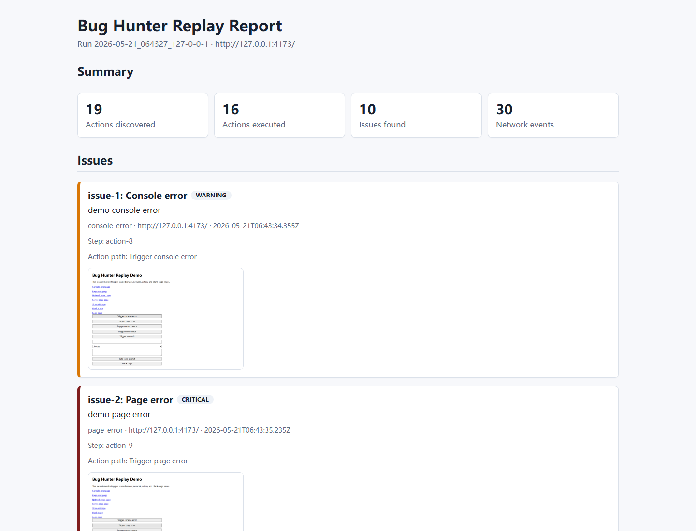
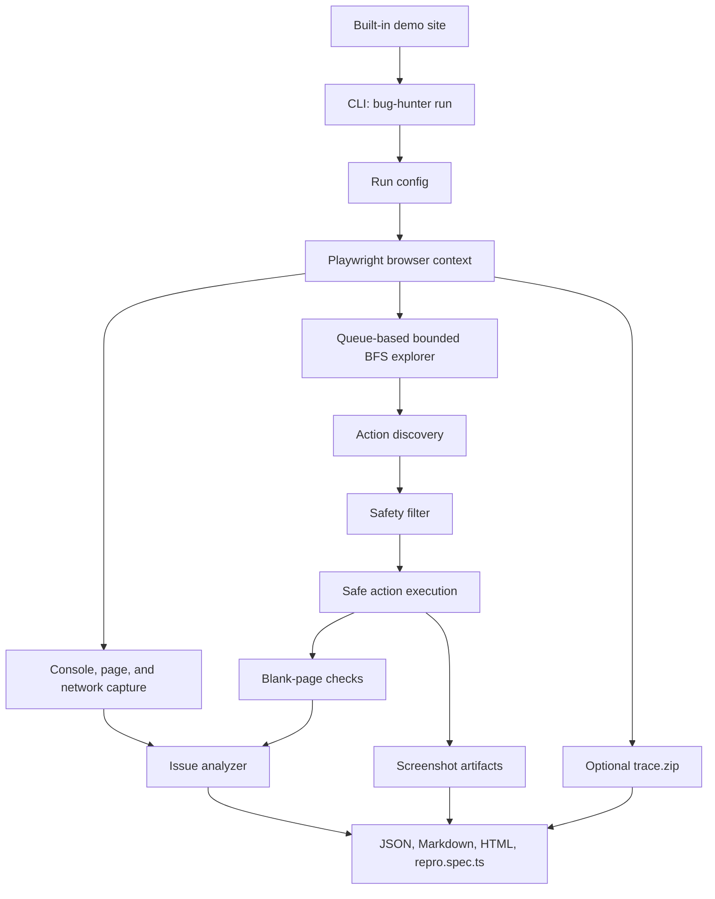

# Bug Hunter Replay

Bug Hunter Replay is a local-first Playwright CLI that performs bounded web page exploration, captures browser/runtime/network signals, and writes shareable bug evidence reports.

## Features

- Runs from the command line against a URL you own or are authorized to test.
- Performs queue-based bounded BFS exploration with `maxDepth`, `maxActions`, and same-origin guardrails.
- Captures console errors, page errors, failed requests, HTTP errors, slow requests, and blank-page states.
- Executes safe discovered actions such as same-origin links, buttons, fills, and selects.
- Skips destructive-looking actions, unknown form submits, password inputs, and file inputs by default.
- Saves screenshots for the initial page and action steps.
- Optionally records a Playwright trace at `traces/trace.zip`; use `--no-trace` to disable it.
- Generates local `report.json`, `report.md`, `report.html`, and issue-aware `repro.spec.ts` artifacts.
- Includes a built-in demo site for deterministic local showcase runs.

## Tech Stack

- Node.js 20+
- TypeScript
- pnpm / Corepack
- Commander
- Playwright
- Vitest
- ESLint

## Quick Start

```bash
corepack pnpm install
corepack pnpm exec playwright install chromium --only-shell
corepack pnpm build
```

Run the built-in demo site in one terminal:

```bash
corepack pnpm demo-site -- --port 4173
```

Generate a v0.1.0 demo report from another terminal:

```bash
corepack pnpm dev -- run http://127.0.0.1:4173/ --max-depth 2 --max-actions 16 --slow-threshold 100
```

Disable Playwright trace collection when you only need lightweight reports:

```bash
corepack pnpm dev -- run http://127.0.0.1:4173/ --max-depth 2 --max-actions 16 --slow-threshold 100 --no-trace
```

The CLI prints the generated `report.json` path under `reports/<run-id>/`.

## Report Preview



## Demo Site

The demo site is a lightweight local Node.js HTTP server with stable routes for showcasing the capture pipeline:

- `/` - homepage with same-origin links and safe triggers.
- `/console-error` - button-triggered `console.error`.
- `/page-error` - button-triggered runtime exception.
- `/network-error` - failed request trigger.
- `/server-error` - HTTP 500 response.
- `/slow-api` - delayed API response.
- `/blank` - button-triggered blank page.
- `/form` - safe form controls for fill/select coverage.

Start it with:

```bash
corepack pnpm demo-site -- --port 4173
```

## Report Output

Each run creates a directory under `reports/`:

```text
reports/<run-id>/
  report.json
  report.md
  report.html
  repro.spec.ts
  screenshots/
    initial.png
    step-001-before.png
    step-001-after.png
  traces/
    trace.zip
```

`traces/trace.zip` is only written when trace collection is enabled. It is enabled by default and disabled with `--no-trace`.

Artifact roles:

- `report.json` - structured run data for tools or deeper inspection.
- `report.md` - readable Markdown summary.
- `report.html` - offline single-file HTML report with inline CSS and relative screenshots.
- `repro.spec.ts` - Playwright spec that replays the relevant action path and asserts the captured issue signal.
- `screenshots/` - initial and step screenshots captured during the run.
- `traces/trace.zip` - Playwright trace for timeline-level debugging.

## Safety Boundary

Use Bug Hunter Replay only on websites you own or have explicit permission to test.

This project is not a security scanner, vulnerability exploitation tool, attack framework, dashboard, cloud platform, or AI debugging product. It is a local debugging/demo utility for bounded browser exploration, runtime capture, network capture, screenshots, traces, and local report generation.

Default safety behavior:

- Same-origin exploration is enabled by default.
- Dangerous English and Chinese keywords are skipped.
- Destructive-looking `href`, form action, button text, `aria-label`, `name`, and `id` values are treated as risk signals.
- `input[type=submit]`, `button[type=submit]`, default submit buttons inside forms, password inputs, and file inputs are skipped by default.
- Unknown form submission is not performed.

## Architecture



## Development Checks

```bash
corepack pnpm build
corepack pnpm test
corepack pnpm lint
corepack pnpm typecheck
```
