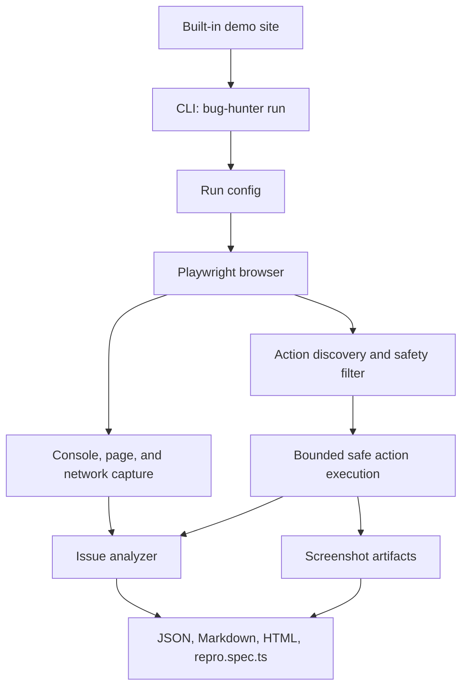

# Bug Hunter Replay

Bug Hunter Replay is a local-first Playwright CLI that explores a web page, captures browser/runtime/network signals, and writes shareable bug evidence reports.

## Features

- Runs from the command line against a URL you own or are authorized to test.
- Performs bounded same-origin auto exploration from the start page.
- Captures console errors, page errors, failed requests, HTTP errors, slow requests, and blank-page states.
- Executes safe discovered actions such as links, buttons, fills, and selects while skipping dangerous or unknown form submits by default.
- Saves screenshots for the initial page and action steps.
- Generates local `report.json`, `report.md`, `report.html`, and `repro.spec.ts` artifacts.
- Includes a built-in demo site for deterministic local showcase runs.

## Tech Stack

- Node.js 20+
- TypeScript
- pnpm / Corepack
- Commander
- Playwright
- Vitest
- ESLint

## Quick Start

```bash
corepack pnpm install
corepack pnpm exec playwright install chromium --only-shell
corepack pnpm build
```

Run the built-in demo site in one terminal:

```bash
corepack pnpm demo-site -- --port 4173
```

Generate a report from another terminal:

```bash
corepack pnpm dev -- run http://127.0.0.1:4173/ --max-actions 20 --slow-threshold 100
```

The CLI prints the generated `report.json` path under `reports/<run-id>/`.

## Demo Site

The demo site is a lightweight local Node.js HTTP server with stable routes for showcasing the capture pipeline:

- `/` — homepage with same-origin links and safe triggers
- `/console-error` — button-triggered `console.error`
- `/page-error` — button-triggered runtime exception
- `/network-error` — failed request trigger
- `/server-error` — HTTP 500 response
- `/slow-api` — delayed API response
- `/blank` — button-triggered blank page
- `/form` — safe form controls for fill/select coverage

Start it with:

```bash
corepack pnpm demo-site -- --port 4173
```

## Report Artifacts

Each run creates a directory under `reports/` containing:

- `report.json` — structured run data for tools or deeper inspection.
- `report.md` — readable Markdown summary.
- `report.html` — offline single-file HTML report with inline CSS and relative screenshots.
- `repro.spec.ts` — minimal Playwright spec for reproducing the selected issue signal.
- `screenshots/` — initial and step screenshots captured during the run.

## Safety Boundary

Use Bug Hunter Replay only on websites you own or have explicit permission to test.

This project is not a security scanner, vulnerability exploitation tool, or attack framework. It is a local debugging/demo utility for bounded browser exploration, runtime capture, network capture, screenshots, and local report generation.

## Architecture



## Development Checks

```bash
corepack pnpm build
corepack pnpm test
corepack pnpm lint
corepack pnpm typecheck
```

## Resume Description Suggestion

Built a local-first TypeScript CLI using Playwright to perform bounded web page auto exploration, capture console/network/runtime failures, save screenshots, and generate JSON/Markdown/HTML reports plus a minimal Playwright reproduction spec. Added a deterministic local demo site and CI coverage for build, tests, linting, type checking, and browser installation.
